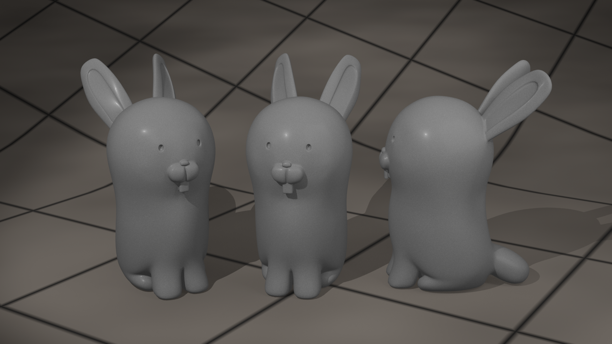

# GlendaBlenda - A Plan 9 Glenda 3d model

This 3d model is optimized for 3d printing.

## 3D print details

- The 3d model itself is scaled to a tenth number on a millimeter scale. Depending on the software you use, it's 1cm, 10cm, 100cm or anything like that to make scaling easier for you in the slicer.
- I try to minimize supports. In an ideal world, you don't need supports for this print.
- The eyes and ears are holes so the print looks good without coloring.
- The original artwork is created by Renée French.

## Customization

To adjust the model to your printing requirements, I added a few modifiers:

- The structure that connects the teeth to the body can be extended to print the teeth without supports. Move the `Tooth Support` circle.
- The size of the eyes can be increased. Scale the `Eye Size` circle.

## Printing

### Smaller prints

- I recommend to customize the model so you can print it without supports.
- Print with a brim or a raft.
